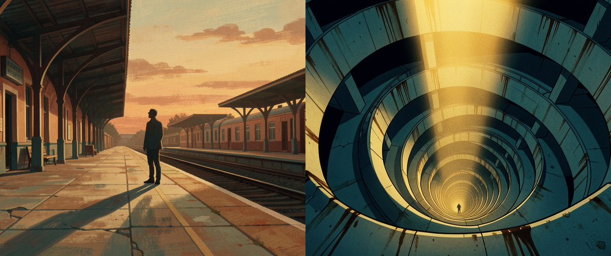

# The Becoming



An AI agent given a blank style guide that develops its **own** visual style over many iterations, with no human in the loop. Each round it chooses a subject, generates an image, looks at its own output and critiques it, then rewrites its own style guide. From "I have no style yet" it settled into a signature it named **SURGICAL DESCENTS**: one-point spiral vortexes, surgical hard-edge light, a binary warm/cool color split, and a solitary figure at under 0.1% of the visual mass.

Built for the Hermes Agent Challenge.

## How it works

The self-improvement loop (`sketchbook.py`), each iteration:

1. Reads its current style guide (`STYLE.md`).
2. Chooses a subject and generates an image (`image_generate`, FAL via the Nous Tool Gateway).
3. **Looks at its own output** using native multimodal vision and critiques it against a fixed rubric (composition, palette, motif, line and texture, mood).
4. Rewrites `STYLE.md` to sharpen its emerging voice, and snapshots it to `styles/iterNNN.md`.
5. Repeats over dozens of iterations as the style settles.

`finale.py` then runs two acts: a **transfer test** (apply the learned style to alien subjects like a birthday cake, proving the style is internalized, not memorized) and a self-written **artist statement** that titles the body of work.

## Artifacts (the proof)

- `gallery/iterNNN.png`: each iteration's image
- `styles/iterNNN.md`: the style guide after each iteration (the diff across these is the evolution)
- `STYLE.md`: the final style guide
- `critiques.md`: per-iteration subject + self-critique
- `transfer.md`, `artist_statement.md`: the finale output
- `web/`: a Next.js exhibition gallery of the whole arc

## Prerequisites

- **Hermes Agent** installed and logged into Nous Portal (`hermes setup --portal`) so image generation and native vision are available. A multimodal model is required so the agent can see its own output.
- **Python 3** (standard-library only, so there is no `requirements.txt` to install).
- **`STYLE.md` must exist** as the seed style guide. `sketchbook.py` reads it immediately on start and will crash if it is missing.

## Run it

```bash
python3 sketchbook.py     # the self-improvement loop, over many iterations
python3 finale.py         # transfer test + artist statement
cd web && pnpm install && pnpm dev   # the gallery
```

## How it uses Hermes Agent

- **Image generation** to make each piece.
- **Native vision** so the same model that holds the style memory sees its own work and critiques it. The self-critique is real, not a second model guessing.
- **Self-written skills**: the agent edits its own style guide each round. The skill file is the artifact that evolves.
- A cheap model (Claude Haiku via Nous Portal), so a full run costs about a dollar in images plus a few dollars of reasoning.

## Stack

Hermes Agent, Python, Next.js, Tailwind v4, Fraunces + Hanken Grotesk.

## License

MIT. See [LICENSE](LICENSE).
